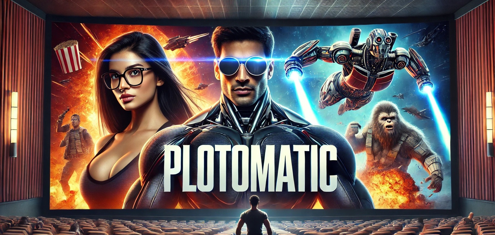

# **:clapper: Plot-o-matic Story Generator :clapper:**

Transform your story ideas into immersive graphic novels, animations, and audio experiences—all from a single prompt!

## :rocket: Write an Entire Graphic Novel with One Prompt!

Dive into a world where a single idea sparks entire universes. From rogue ninjas overthrowing AI overlords to epic knights on mystical quests, Plot-o-matic Story Generator brings your story to life across various media—quickly, creatively, and with endless customization options.

### :star2: **Story Samples**

Here are some examples of what Plot-o-matic can generate:

---

### :robot: **Robot Ninja** *(GIF)*
Prompt: 
> A video game: In a futuristic world, a team of rogue robot ninjas must overthrow their corrupt AI overlords to reclaim their freedom and save humanity.

---

### :video_game: **8-bit Video Game** *(GIF)*
Prompt:
> 8-bit Video Game

---

### :microphone: **Voiceover** *(Audio)*
Prompt:
> Calm and authoritative, with a hint of warmth.

[Sample Audio :headphones:](./samples/dr_elara.wav)

---

### :musical_note: **Suspenseful Music** *(Music)*
Prompt:
> Tense and suspenseful.

[Sample Music :musical_note:](./samples/tense_focused.wav)

---

### :european_castle: **Fantasy Knight Adventure** *(Video with Voiceover)* 
Prompt:
> A fantasy live-action movie: A blonde-haired, blue-eyed knight named Matt must journey to the center of the world to forge a magical weapon capable of defeating an ancient dragon and saving the princess and kingdom.

[Sample Video :arrow_forward:](./samples/princess.mp4)

---

## :book: **About the Project**

Plot-o-matic combines the power of AI to turn any story idea into a wide variety of storytelling formats:

- Graphic Novels & Books
- Short Films
- Podcasts & Audio Dramas
- Comics
- Video Game Storylines & Assets
- Plays
- Cartoons & animations
- Documentaries
- Song Lyrics and much more!

## :hammer_and_wrench: **Technologies**

We leverage a suite of AI tools to bring your stories to life:

- [LlamaIndex](https://docs.llamaindex.ai/en/stable/examples/llm/nvidia_nim/) :dromedary_camel: - used to generate chapters/scenes while maintaining coherence
- [NeMo Guardrails](https://docs.nvidia.com/nemo/guardrails/) - Prevent NSFW and enforce JSON output
- [NIM microservice](https://build.nvidia.com/explore/discover) - For serving LLMs locally or using NVIDIA NIM in the cloud
- [Nemotron 70b](https://build.nvidia.com/nvidia/llama-3_1-nemotron-70b-instruct) - LLM for NIM
- [Flux.1-dev](https://huggingface.co/black-forest-labs/FLUX.1-dev) for image creation
- [CogVideoX-5b-I2V](https://huggingface.co/THUDM/CogVideoX-5b-I2V) - Text/image to video
- [Parler-TTS](https://github.com/huggingface/parler-tts) for speech creation
- [fish-speech](https://github.com/fishaudio/fish-speech) OR [CoquiTTS](https://github.com/coqui-ai/TTS) for speech cloning
- [Musigen](https://huggingface.co/facebook/musicgen-large) for music

## :memo: **Step-by-Step Notebooks**

### [view_plot.ipynb](./view_plot.ipynb)
- **Review and Evolve the Plot**

This notebook provides tools to visualize and track the story's development. After each generation step, you can revisit this notebook to review the evolving plot through detailed overviews, interactive diagrams, and other visualization tools. 

As you refine the story prompt or adjust the model's settings, use this notebook to see how those changes impact the narrative structure. With each re-run, observe how characters, themes, and events unfold differently—allowing you to shape and perfect the story iteratively.

---

### [0_install_prepreqs.ipynb](./0_install_prepreqs.ipynb)
- Set up conda env
- Install conda packages
- Install pip packages

### [1_story_prompt.ipynb](./1_story_prompt.ipynb)
- Set the input prompt for the story and kick it off

### [2_title_plot.ipynbb](./2_title_plot.ipynbb)
- Generate plot summary
- Generate story title
- Decide Genre + Medium + Visual Style

### [3_character_descriptions.ipynb](./3_character_descriptions.ipynb)
- Generate a list of characters and descriptions

### [4_scene_descriptions.ipynb](./4_scene_descriptions.ipynb)
- Generate a list of scenes

### [5_character_images.ipynb](./5_character_images.ipynb)
- Generate images for characters

### [6_scene_images.ipynb](./6_scene_images.ipynb)
- Generate scene images

### [7_character_animated.ipynb](./7_character_animated.ipynb)
- Generate animations for character images

### *[8_prop_descriptions.ipynb](./8_prop_descriptions.ipynb)* (WIP :construction:)
- Generate a list of props

### *[9_prop_images.ipynb](./9_prop_images.ipynb)* (WIP :construction:)
- Generate prop images

### :sparkles: *[10_sprite_extraction.ipynb](./10_sprite_extraction.ipynb)* (WIP :construction:)
- Extract sprites

### :microphone: [11_character_voice.ipynb](./11_character_voice.ipynb)
- Character voice baseline for grounding
- Character voice clone

### [12_character_video.ipynb](./12_character_video.ipynb)
- Make video from audio and video clips and combine them with ffmpeg

### :musical_note: [13_music.ipynb](./13_music.ipynb)
- Music for each scene

---

### [test_llm.ipynb](./test_llm.ipynb)
- Compare the creativity of different models
- **nemotron:70b** - This one is arbitrarily my favorite

### *[generate_samples.ipynb](./generate_samples.ipynb)* (WIP :construction:)
- Use LlamaIndex to generate summaries from real literature to use as few-shot examples 

## TODO:
- Plot Diagram
- Generate screenplay
- Gallery
- Move voice description to separate step
- Improve animation descriptions
- Voice description should describe better like: "A youthful male voice with a distinct Latin American accent speaks clearly and energetically. The tone is persuasive and determined, occasionally revealing subtle hints of vulnerability. The speaker's voice has a warm timbre with a slight melodic lilt typical of Latin American Spanish speakers. The speech pattern includes softened consonants and rhythmic intonation. The audio quality is exceptionally high, with a close-up feel that captures the nuances of the voice, including breath control and subtle vocal inflections. The overall delivery is dynamic and engaging, with emphasis on key words to enhance persuasiveness."